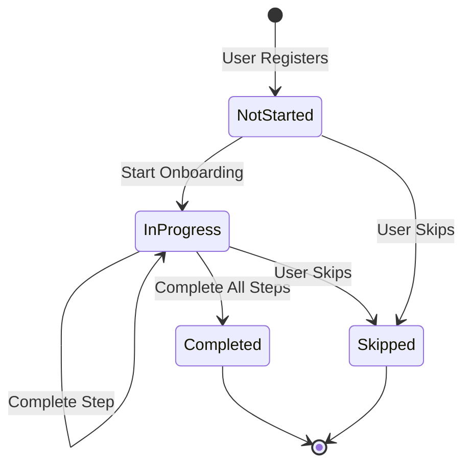
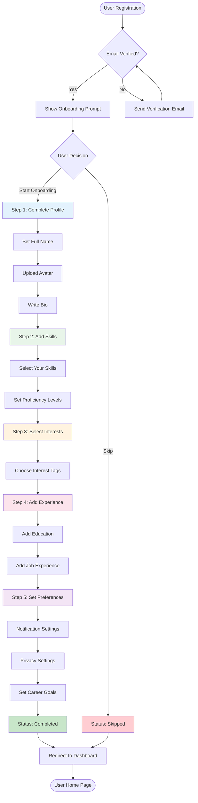
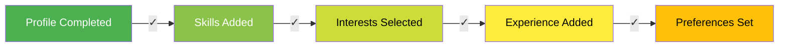
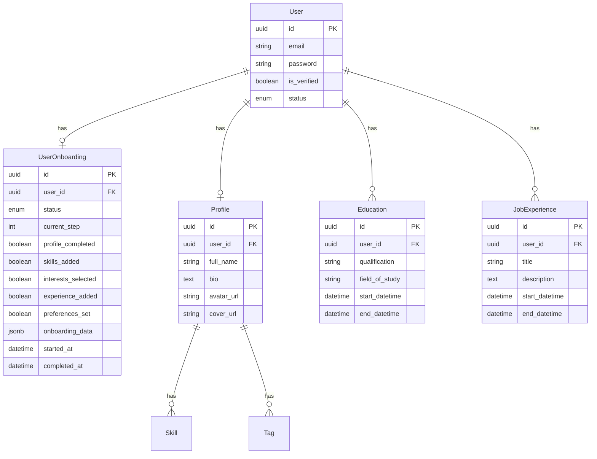
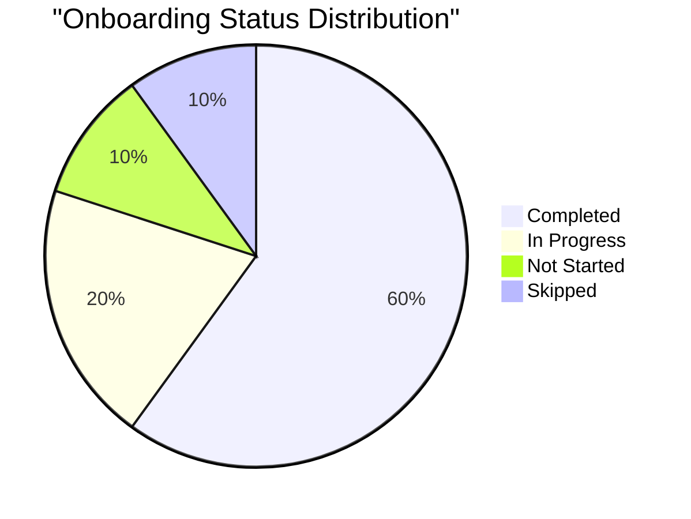
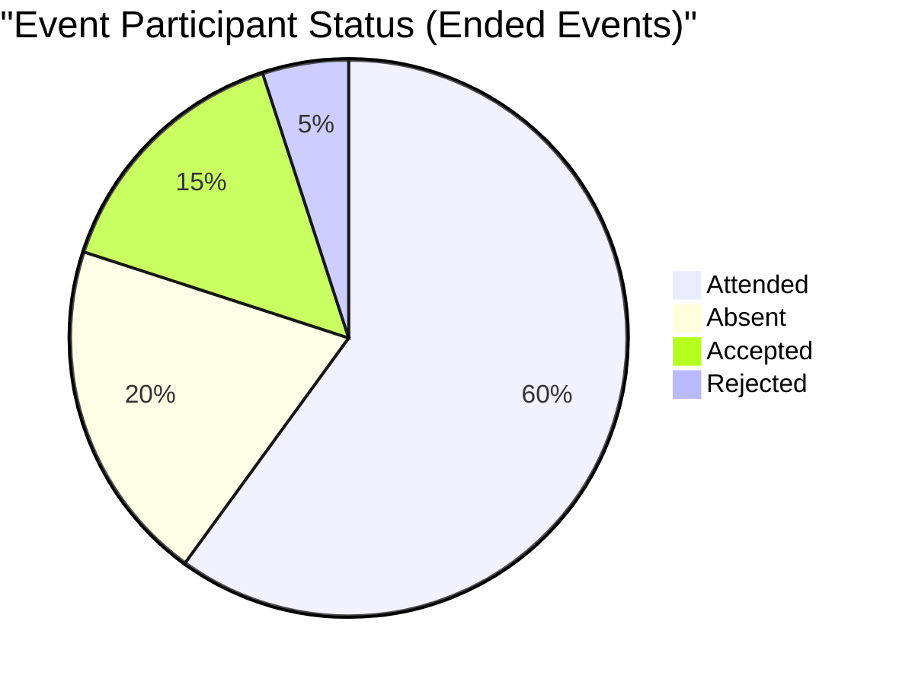
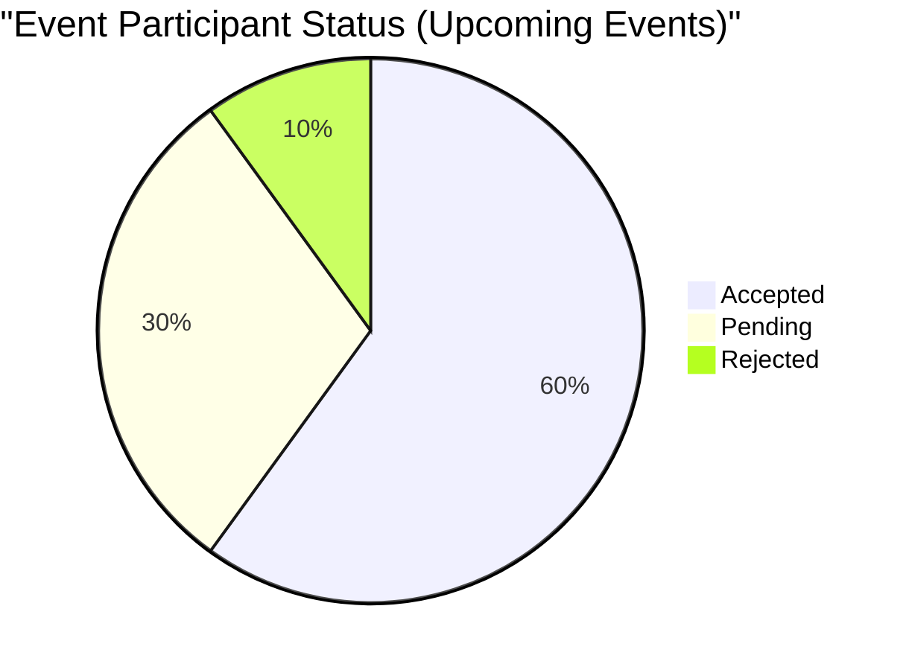
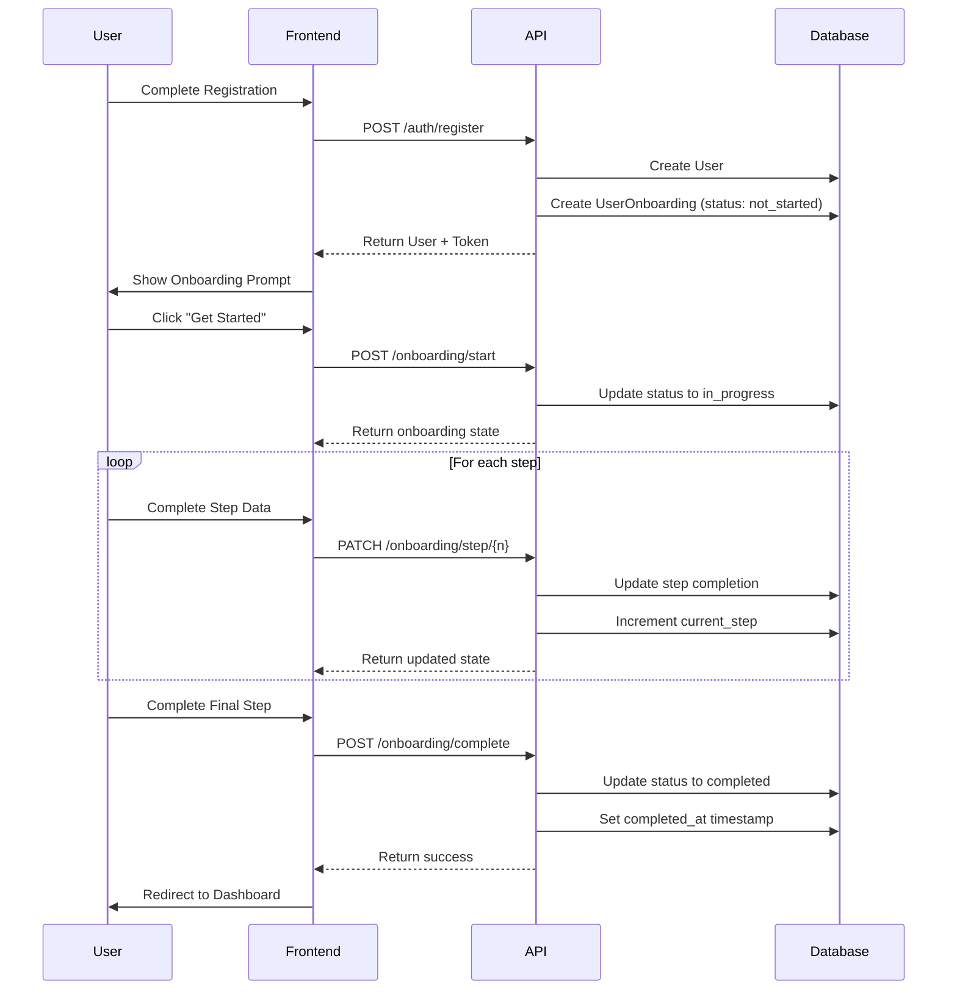

# Onboarding Flow Visualization

## User Onboarding States

## Detailed Onboarding Flow

## Onboarding Progress Tracking

## Database Relationships

## Seeder Data Distribution

## API Integration Example

## Key Takeaways

1. **Flexible States**: Support for multiple onboarding states (not_started, in_progress, completed, skipped)
2. **Progressive Tracking**: Track each step individually with boolean flags
3. **Flexible Storage**: JSONB field for storing additional onboarding data
4. **Realistic Data**: Seeders create diverse onboarding states for testing
5. **Production Ready**: Designed to support real-world onboarding flows
